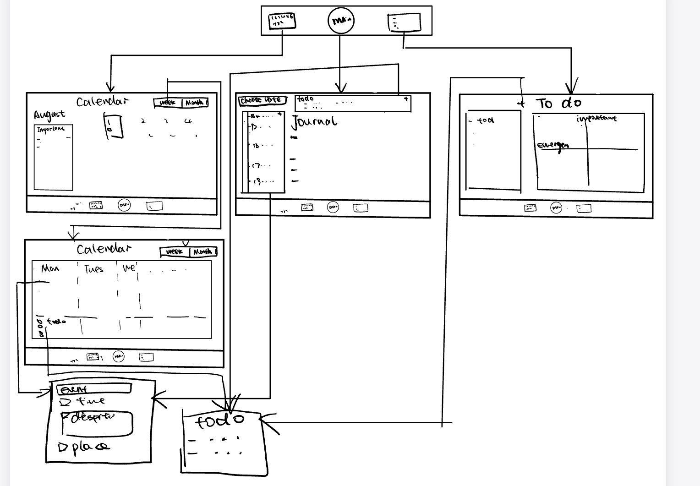

# LifeSync

## Table of Contents

1. [Overview](#Overview)
2. [Product Spec](#Product-Spec)
3. [Wireframes](#Wireframes)
4. [Schema](#Schema)

## Overview

### Current Video Demo

    
  

### Description

LifeSync is an integrated productivity and personal growth app that combines advanced calendar functions, a to-do list, and journaling into a seamless interface. The app is designed to cater to users who want to not only manage their daily tasks but also reflect on their personal achievements and areas for improvement. LifeSync encourages active scheduling and goal-setting while providing tools for personal reflection and progress tracking. (Mainly for Ipad)

### App Evaluation

**Category:** Productivity, Lifestyle

**Mobile:** Mobile functionality is critical for LifeSync as it offers users the convenience of updating their schedules, tasks, and journal entries on the go. The app leverages device capabilities like push notifications for reminders, a camera for capturing moments or scanning documents, and location services to suggest task completion based on proximity to relevant places.

**Story:** LifeSync acts as a personal assistant and a reflective journal. It's designed for individuals who strive for efficiency and self-improvement. By combining essential productivity tools with reflective journaling, users can manage their schedules, track their habits, and reflect on their personal growth, all within a single app.

**Market:** The target market includes students, professionals, and anyone looking to enhance their productivity and personal growth. LifeSync can be marketed directly to consumers through app stores or potentially through partnerships with educational institutions and corporations seeking to provide productivity tools to their students and employees. 

**Habit:** LifeSync is intended to be used daily. The calendar and to-do list features encourage regular check-ins throughout the day, while the journaling and reflection features are ideal for end-of-day summaries. Habit tracking functionalities motivate users to maintain consistency in their personal and professional goals.

**Scope:** 
- V1: Basic calendar and to-do list functionalities integrated with notification reminders.
- V2: Introduction of the journaling and template customization features for daily reflections and habit tracking.
- V3: Enhanced calendar views (weekly and monthly) with the ability to integrate personal goals and detailed habit tracking.
- V4: Advanced features such as AI-driven insights based on task completion and journal entries, and integration with external apps (e.g., fitness trackers, educational apps).

## Product Spec

### 1. User Stories (Required and Optional)

**Required Must-have Stories**

* Users can view their daily, weekly, and monthly calendar.
* Users can add, edit, and delete tasks in their to-do list.
* Users can set reminders for upcoming tasks and events.
* Users can write daily journal entries.
* Users can track various personal habits.

**Optional Nice-to-have Stories**

* Integration with external calendars (e.g., Google Calendar, Outlook).
* Photo attachments in journal entries.
* Sharing of journal entries and tasks with others.
* Customizable themes and app appearances.

### 2. Screen Archetypes

- [ ] Calendar View
* Users can view and manage their schedule in daily, weekly, or monthly formats.(Include to do list and events)

- [ ] To-Do List
* Users can add new tasks, mark tasks as complete, and prioritize tasks.

- [ ] Combine Screen
* User can view their daily schedule and To-do List and also Journal within one screen, which will make sure user can fully records their daily schedule

### 3. Navigation

**Tab Navigation** (Tab to Screen)

* Calendar
* To-Do List
* Main

**Flow Navigation** (Screen to Screen)

- [ ] Calender
* Navigates to detailed day view when a date is selected.
* List the yearly/weekly/daily to do list when select different view
- [ ] To-do list
* Opens task editor on tapping a task.
- [ ] Main Screen
*  Displays the daily schedule, to-do list, and journal entries all in one unified view, you'll need to consider both the design and the functionality aspects.

## Wireframes

### [BONUS] Digital Wireframes & Mockups

### [BONUS] Interactive Prototype

## Schema 

[This section will be completed in Unit 9]

### Models

[Add table of models]

### Networking

- [Add list of network requests by screen ]
- [Create basic snippets for each Parse network request]
- [OPTIONAL: List endpoints if using existing API such as Yelp]
